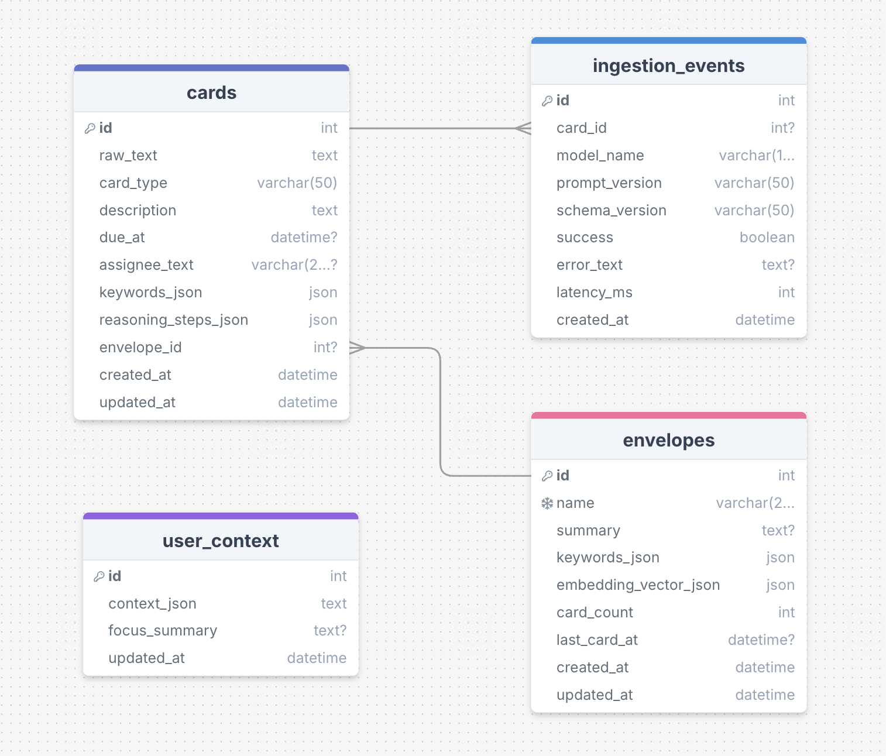
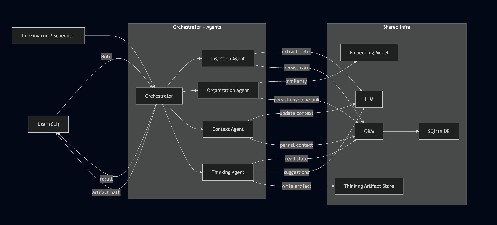

# Contextual Personal Assistant

A personal assistant that turns unstructured notes into structured cards, organizes them into envelopes, maintains user context, and generates proactive suggestions.


## Prerequisites
- Docker installed and running on host.
- [Ollama](https://ollama.com/) installed on host.
- Python 3.11+ is only needed for non-Docker local runs.

## Step-by-Step Setup (Docker-First)

1. Clone and enter project root.
```bash
git clone https://github.com/DasithEdirisinghe/contextual-assistant.git
cd contextual-assistant
```

2. Build the Docker image.
```bash
docker build -t contextual-assistant:latest .
```

3. Pull required Ollama models on host.
```bash
ollama pull llama3.1:8b
ollama pull qwen3-embedding:0.6b
```

4. Start Ollama in a separate terminal.
```bash
ollama serve
```

## Configuration
Use `.env.docker` as default, or create `.env.docker.local` and pass it via `ENV_FILE`.

Required keys to verify:
```env
LLM_PROVIDER=ollama
LLM_MODEL=llama3.1:8b
LLM_BASE_URL=http://host.docker.internal:11434/v1

EMBEDDING_PROVIDER=ollama
EMBEDDING_MODEL=qwen3-embedding:0.6b
EMBEDDING_BASE_URL=http://host.docker.internal:11434/v1

DATABASE_URL=sqlite:///data/assistant-demo.db
```

Notes:
- If the DB file does not exist, SQLite creates it automatically.
- If it exists, the app reuses it.
- For normal usage, do not change these routing/scoring settings:
  - `ENVELOPE_ASSIGN_THRESHOLD`
  - `EMBEDDING_WEIGHT`
  - `KEYWORD_WEIGHT`
  - `ENTITY_WEIGHT`

## Run the App (Interactive)

Start the interactive assistant:
```bash
ENV_FILE=.env.docker.local ./scripts/docker_run.sh
```
(Or use `ENV_FILE=.env.docker` if you keep defaults there.)

Development note:
- `scripts/docker_run.sh` bind-mounts `src/` and `scripts/`, so code changes are available immediately after restarting the container.
- Rebuild image (`docker build ...`) only when dependencies or Dockerfile-level setup changes.

What happens after launch:
- The container starts the interactive CLI prompt.
- You enter commands directly in that shell.

Runtime disclaimer:
- This pipeline has been tested primarily with Ollama using `llama3.1:8b` as the LLM.
- If you switch to other LLMs/providers (including OpenAI), validate behavior separately.
- Current validation environment was macOS with 24 GB VRAM.
- It should work on other hosts, but for Ollama-based models use at least 16 GB VRAM for smoother execution.

## First-Run Usage

Example commands inside interactive CLI:
- `db-reset`: Clears and recreates the database schema (with confirmation prompt).
- `ingest "Call Sarah about Q3 budget next Monday"`: Ingests a raw note and runs ingestion -> organization -> context update pipeline.
- `cards`: Lists recent cards with type, due date, envelope link, keywords, and assignee.
- `envelopes [cards_per_envelope]`: Lists envelopes and previews recent cards in each envelope (default 5).
- `context`: Shows the persisted user context snapshot (`user_context`).
- `thinking-start 3600`: Starts background thinking scheduler (every 3600 seconds).
- `thinking-status`: Shows whether thinking scheduler is running and current interval.
- `thinking-stop`: Stops background thinking scheduler.
- `artifacts`: Lists generated thinking suggestion artifact files.
- `show <artifact_path>`: Opens and prints one artifact JSON file.
- `exit`: Exits interactive CLI.

`exit` stops the CLI session and also stops the in-process thinking scheduler.

### Interactive Demo Sequence
After the interactive shell starts, you can run this sequence directly:

```text
ingest "Book a hotel for next week trip with Gibson"
ingest "Do the Lit review of the TSRGS paper"
ingest "Buy a birthday present to mike"
ingest "Discuss the outcome of the TSRGS paper with Paul today"
ingest "Bring 1 litre of milk when way to home"
ingest "Ask Paul about his opinion on new research methodology of TSRGS paper"
ingest "Buy coffee and sugar for home"
cards
envelopes
```

## Architecture & Design

### Why LangChain
- Runnable-based pipeline is used in this project:
  - Ingestion is implemented as composable LangChain runnable stages (prompt render -> model call -> parse/normalize), which keeps LLM behavior modular and testable.
- Schema-safe extraction contracts:
  - LangChain integrates cleanly with Pydantic structured outputs, so extracted fields map to strict card/context schemas instead of brittle text parsing.
- Future workflow scaling path:
  - If orchestration becomes more stateful/branching, this codebase can move naturally to LangGraph while keeping existing LangChain prompt/model/runnable components.

### Why SQLite + SQLAlchemy
- SQLite is chosen for assignment constraints and local-first execution:
  - zero external infrastructure,
  - file-based persistence,
  - simple Docker + local development workflow.
- SQLAlchemy is used for explicit schema modeling and repository boundaries:
  - clear table contracts,
  - controlled transactions in orchestrator flow,
  - easier migration of logic from Python loops into SQL queries where needed.

### Database Design



- `cards`:
  - Core normalized record for each ingested note.
  - Stores extracted operational fields used downstream (`card_type`, `description`, `due_at`, `assignee_text`, `keywords_json`, `envelope_id`, timestamps, reasoning).
- `envelopes`:
  - Represents higher-level grouping context.
  - Stores envelope profile fields (`name`, `summary`, `keywords_json`, `embedding_vector_json`, `card_count`, `last_card_at`) used for routing and refinement.
- `user_context`:
  - Single authoritative snapshot table (`id=1`) for current global user context and focus summary.
  - Snapshot model is intentional: retrieval is O(1) and no merge across historical rows is required at read time.
- `ingestion_events`:
  - Operational traceability for ingestion runs (prompt/model version observability and debugging).
- Thinking outputs:
  - Persisted as JSON artifacts in `data/thinking_runs` instead of DB tables to keep scheduled reasoning outputs append-only and easy to inspect/export.

### Database-Level Optimizations Implemented
- SQL-bounded reads at repository level:
  - `list_cards(limit=...)` and `list_envelopes(limit=...)` push limits to SQL instead of loading all rows and slicing in Python.
- SQL-first context evidence selection:
  - “Important card per envelope” selection is done with SQL window functions (`row_number() over (partition by envelope_id ...)`) instead of Python nested loops.
  - Final evidence card fetch is done in a consolidated query with required joins.
- Query-shape optimization over index tuning:
  - Current optimization strategy focuses on reducing scanned rows and moving ranking/filter logic into SQL.
  - Explicit ORM index declarations were intentionally not added in this phase (keeps schema simpler until profiling proves index need).


### High Level Flow Diagram




- `Orchestrator` is the central coordinator that orchestrates each pipeline.
- The system currently supports two workflows:
  1. Ingestion Workflow (synchronous)
  2. Thinking Workflow (triggered/scheduled)
- In the ingestion path, three agents are working synchronously:
  - Ingestion Agent
  - Organization Agent
  - Context Agent
- Each ingestion-stage agent uses its own prompt template family to communicate with the LLM:
  - `ingestion*.jinja`
  - `envelope_refine*.jinja`
  - `context_update*.jinja`
- Thinking Agent works separately based on a trigger and uses a dedicated reasoning-based prompt (`thinking*.jinja`).
- Shared infrastructure in both workflows:
  - LLM provider
  - embedding model
  - SQLite database
  - thinking artifact store
- Active prompt versions are resolved from environment overrides plus `registry.yaml`.

### Supported Workflows

- **Workflow 1: Ingestion (synchronous request path)**
  - user note -> orchestrator -> ingestion -> organization -> context -> persist + response.
- **Workflow 2: Thinking (asynchronous trigger path)**
  - trigger -> orchestrator -> thinking agent -> artifact output.

### Ingestion Workflow (Synchronous)

#### 1) Orchestrator role
- Calls agents in a fixed order.
- Controls transaction boundary and event logging for ingestion.
- Ensures the final response reflects coherent card, envelope, and context state.

#### 2) Ingestion Agent behavior (`ingestion*.jinja`)
- Converts unstructured note text into a strict card extraction contract.
- Uses the ingestion prompt template to produce schema-valid fields:
  - `card_type`, `description`, `date_text`, `assignee`, `context_keywords`, `reasoning_steps`, `confidence`.
- Uses structured parsing and validation so malformed model outputs are rejected early.
- Applies deterministic temporal normalization:
  - converts natural language time phrase (`date_text`) into machine-usable `due_at`.
- Preserves extraction quality through conservative behavior:
  - uncertain fields remain null rather than being invented.
- Produces a validated card payload that can be safely consumed by organization/context stages.

#### 3) Organization Agent behavior (`envelope_refine*.jinja`)
- Matches the new card against existing envelopes using a hybrid score:
  - semantic similarity from embeddings,
  - lexical overlap from keywords,
  - assignee-aware signal when person/team context aligns.
- Uses weighted scoring to produce one final match score per envelope, then selects the best candidate.
- Applies threshold-based routing:
  - if best score is strong enough -> assign to existing envelope,
  - otherwise -> create a new envelope with a seed name/summary.
- After routing, refreshes envelope profile so future matching improves:
  - top keywords (recency-aware),
  - embedding centroid,
  - card count and latest activity timestamp.
- Uses the envelope refinement prompt to improve envelope title/summary language while keeping topic continuity.
- Persists the final card-to-envelope link and updated envelope profile state.

#### 4) Context Agent behavior (`context_update*.jinja`)
- Maintains one evolving user context snapshot that represents current priorities and themes.
- Builds a focused evidence set instead of sending full history:
  - most recent global cards,
  - plus one important card from active envelopes.
- Importance is driven by practical signals such as card type, due date presence, assignee presence, and keyword richness.
- Combines previous context snapshot + current evidence so updates are both:
  - continuous (no abrupt context resets),
  - recent (reflect new activity).
- Uses context-update prompt to generate structured context buckets:
  - people, organizations, projects, themes, important upcoming, miscellaneous,
  - and a concise focus summary.
- Writes refreshed `user_context` snapshot; if context update fails, previous snapshot is retained.


### Thinking Workflow (Triggered / Scheduled)

#### 1) Trigger model
- Runs via manual command or scheduler trigger.
- Separate from ingestion latency path.

#### 2) Thinking Agent behavior (`thinking*.jinja`)
- Reads three context layers together:
  - card-level details (actions, deadlines, assignees),
  - envelope-level grouping context,
  - global user context snapshot.
- Uses a dedicated reasoning-based prompt because this is a cross-entity inference task, not direct extraction.
- Generates proactive suggestions in three categories:
  - `next_step` (what to do next),
  - `recommendation` (organization/planning improvements),
  - `conflict` (overlaps/deadline or assignee collisions).
- Produces evidence-backed outputs:
  - each suggestion includes supporting IDs and reasoning steps for traceability.
- Runs separately from ingestion so proactive reasoning does not add latency to note capture.

#### 3) Output model
- Uses JSON-structured output for deterministic parsing.
- Writes results as artifact files under `data/thinking_runs` for auditable review.

-------------------------

### Use of AI Tools

AI tools were used as engineering accelerators during this project.

- Tools used:
  - Cursor + Codex was used for design iteration, refactoring guidance, and documentation improvements.
- Role of AI assistance:
  - architecture alternative brainstorming,
  - code scaffolding/refactoring support,
  - prompt drafting and refinement,
  - test-case idea generation,
  - README wording and structure improvements.
- Human validation:
  - final implementation decisions, code review, and behavior checks were manually validated.
  - test suites and manual CLI checks were used to verify system behavior.

-------------------------

## Potential Next-Step Improvements

1. Decouple synchronous ingest path from heavy post-processing  
Move envelope refinement and context refresh to async workers so note ingestion stays fast under load.

2. Incremental envelope profile updates  
Replace full envelope recomputation on each ingest with incremental updates (embedding centroid, keyword profile, counters), and run periodic full rebuilds only as maintenance.

3. Multi-user data model  
Add `user_id` scoping to cards, envelopes, events, and context snapshot for tenant isolation and true product-scale behavior.

4. Production database + migrations  
Move from SQLite to PostgreSQL for higher concurrency and introduce migration tooling (e.g., Alembic) for controlled schema evolution.

5. LLM reliability and cost controls  
Standardize timeout/retry policies, add extraction validation gates, and log per-agent latency/token usage/cost telemetry.

6. Thinking pipeline efficiency  
Add deterministic candidate pre-filtering before LLM reasoning so thinking runs stay bounded as dataset size grows.

7. Operational observability  
Introduce request tracing and agent-level metrics (latency, failure rate, confidence distribution) with clear SLO/alert thresholds.


-------------------------------

### Optional: Prompt Versioning (Per Agent)

Use this only if you want to create and test new prompt versions.

Versioned prompts live in `src/assistant/prompts/` and are tracked in `registry.yaml`.

##### 0. Update the active prompt template first
Before releasing a new version, edit the active alias file for that agent:
- `src/assistant/prompts/ingestion.jinja`
- `src/assistant/prompts/envelope_refine.jinja`
- `src/assistant/prompts/context_update.jinja`
- `src/assistant/prompts/thinking.jinja`

##### 1. Create a new prompt version
Use the generic release script:

```bash
python scripts/release_prompt.py \
  --prompt-id <ingestion|envelope_refine|context_update|thinking> \
  --changelog "short change summary" \
  --owner "<your_name_or_team>"
```

Examples:

```bash
python scripts/release_prompt.py --prompt-id ingestion --changelog "Improve assignee extraction examples" --owner "mle-team"
python scripts/release_prompt.py --prompt-id envelope_refine --changelog "Refine envelope title constraints" --owner "mle-team"
python scripts/release_prompt.py --prompt-id context_update --changelog "Improve evidence weighting rules" --owner "mle-team"
python scripts/release_prompt.py --prompt-id thinking --changelog "Add conflict-detection few-shot" --owner "mle-team"
```

What this does:
- creates immutable snapshot `<prompt_id>.vN.jinja`
- updates active alias `<prompt_id>.jinja`
- updates `registry.yaml` (`current_version`, `current_template`, changelog, sha256)

##### 2. Activate a prompt version via env
Set the corresponding env key in `.env`, `.env.docker`, or `.env.docker.local`:

```env
INGESTION_PROMPT_VERSION=ingestion.extract.v11
ENVELOPE_REFINE_PROMPT_VERSION=envelope_refine.v2
CONTEXT_UPDATE_PROMPT_VERSION=context_update.v2
THINKING_PROMPT_VERSION=thinking.v2
```
